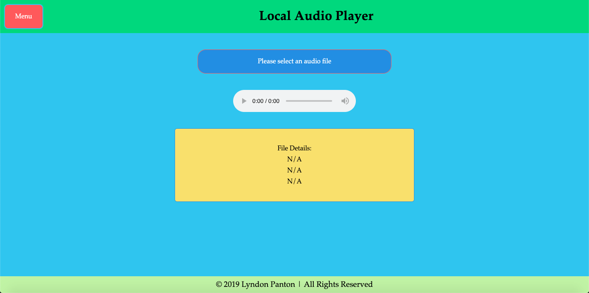
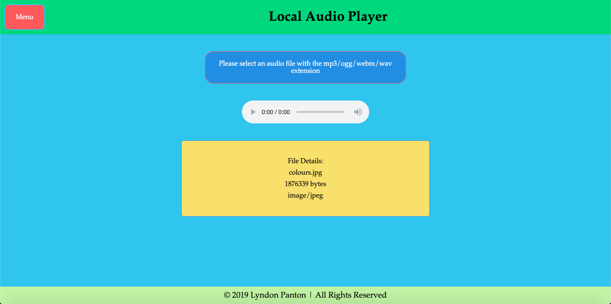
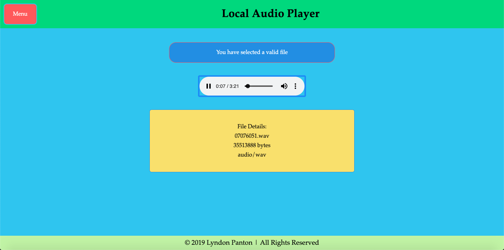
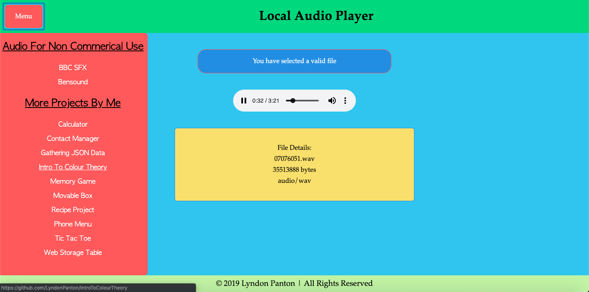

# Local Audio Player

## How To Open
> 1. Open the project's download folder
> 2. Right click on the file named _index.html_
> 3. Choose the _open with_ option
> 4. Open the application in your desired browser

## How To User
> 1. Click on the button to select and audio file from the current device
> 2. If the file has the extension _mp3_, _ogg_, _wav_ or _webm_ and the device/browser supports that format the audio can be played using the audio player
> 3. The details of the file can also be seen in a dialog box
> 4. Click the _menu_ button to open the navigation menu
> 5. The navigation menu has links to websites that have license free audio for commerical use and other projects by me

## Requirements
> 1. This project requires a browser to run
> 2. The browser must have JavaScript available and enabled

## Extra Information
> 1. This project as one of the activities for the w3c and Microsoft's *HTML5 Coding Essentials and Best Practices* course as part of their *Front End Web Developer Professional Certificate*

## Preview

